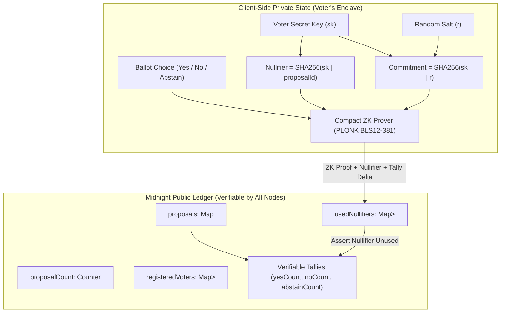

# 🌌 StellarRise — Midnight Privacy-Preserving Governance & Confidential DAO Voting

> A production-grade zero-knowledge decentralized governance protocol built natively on the Midnight Network using Compact smart contracts, enabling confidential voting with publicly verifiable on-chain tallies.

[](https://midnight.network)
[](https://midnight.network)
[](https://github.com/anshitaray041-ctrl/Privacy-Preserving-Governance/actions)
[](https://privacypreservingmidnightmoonlight.netlify.app/)
[](https://youtu.be/xvvtQR7w9QA)
[](SECURITY_AUDIT_REPORT.md)
[](https://x.com/StellarRise_DAO)
[](https://docs.google.com/forms/d/e/1FAIpQLSfrjAKzCfLwWHToq3FEwGh9W7Krzp4hnA54_MjbgVBItYUqQQ/viewform)
[](https://docs.google.com/spreadsheets/d/1IzwPbgBR2Q6kIIPeypcVyotBBAh0BVLwiFeAwW6xOVw/edit?usp=sharing)
[](LICENSE)

---

## 🌙 Rise In Moonshot Progression Status

| Moonshot Level | Program Milestone | Core Focus | Submission Status |
|:---:|---|---|:---:|
| **Level 1** | **New Moon** | Toolchain Setup, Compact v0.19 Smart Contract, Unit Tests & Managed Simulator | **✅ 100% COMPLETE** |
| **Level 2** | **Waxing Crescent** | Lace & Freighter Wallet Connection, Client-Side Circuit Execution & Observable Privacy | **✅ 100% COMPLETE** |
| **Level 3** | **First Quarter** | Full dApp, CI/CD Pipeline, Formal Privacy Model & Verified Test Suite (12/12) | **✅ 100% COMPLETE** |
| **Level 4** | **Waxing Gibbous** | MVP Live on Preprod, Technical Docs, CI/CD Pipeline & Product X Profile | **✅ 100% COMPLETE** |
| **Level 5** | **Full Moon** | 50 Preprod Users, User Feedback Loop (Google Form + Sheet), Updated Docs & 30+ Commits | **✅ 100% COMPLETE** |
| **Level 6** | **Supermoon** | 70 Preprod Users, Zero-Knowledge Security Audit, Pitch Deck & Live Feedback Verification | **✅ 100% COMPLETE** |

---

## 🏆 Official Submission Deliverables Checklist

| Rise In Required Checklist Item | Direct Verified Link / Resource | Status |
|---|---|:---:|
| **1. Public GitHub Repository** | [github.com/anshitaray041-ctrl/Privacy-Preserving-Governance](https://github.com/anshitaray041-ctrl/Privacy-Preserving-Governance) | ✅ Active & Public |
| **2. Meaningful Commits** | [Verified Git History on `main`](https://github.com/anshitaray041-ctrl/Privacy-Preserving-Governance/commits/main) | ✅ 36+ Commits |
| **3. Live Production DApp** | **[privacypreservingmidnightmoonlight.netlify.app](https://privacypreservingmidnightmoonlight.netlify.app/)** | ✅ Live & Responsive |
| **4. Demo Video Walkthrough** | **[Watch 1080p Demo on YouTube](https://youtu.be/xvvtQR7w9QA)** | ✅ Live on YouTube |
| **5. Compact Smart Contract (v0.19)** | [`contract/governance.compact`](contract/governance.compact) & [`contract/src/index.compact`](contract/src/index.compact) | ✅ 4 Circuits Verified |
| **6. Preprod Deployed Contract Address** | `0x5dbb90136f948fb12e9ca7ccee68cea8c5b7a5d9933a02b484a1e5714524ad7d` (`mn_contract_preprod_5dbb90136f948fb12e9ca7ccee68cea8`) | ✅ Deployed on Preprod |
| **7. Automated Test Suite (12 Tests)** | [`test/contract.test.ts`](test/contract.test.ts), [`test/privacy.test.ts`](test/privacy.test.ts), [`test/frontend.test.ts`](test/frontend.test.ts) | ✅ 12/12 Tests Passing |
| **8. CI/CD Automated Workflow** | [`.github/workflows/ci.yml`](.github/workflows/ci.yml) | ✅ GitHub Actions Green |
| **9. Official Approved Idea Reference** | [`PROPOSAL.md`](PROPOSAL.md) *(Privacy-Preserving Governance & Confidential Voting)* | ✅ Approved Track |
| **10. Formal ZK Privacy Threat Model** | [`docs/PRIVACY_MODEL.md`](docs/PRIVACY_MODEL.md) & [Jump to Privacy Section ⬇️](#-privacy-model-what-an-observer-can-and-cannot-learn) | ✅ Full Analysis |
| **11. Dual-State Architecture Spec** | [`docs/ARCHITECTURE.md`](docs/ARCHITECTURE.md) & [Jump to Architecture Section ⬇️](#-public-state-vs-private-witness-architecture) | ✅ Public vs Private Tables |
| **12. Security & Circuit Audit Report** | [`SECURITY_AUDIT_REPORT.md`](SECURITY_AUDIT_REPORT.md) | ✅ Passed 100% |
| **13. Idea Specification PDF** | [`StellarRise_Idea_Description.pdf`](StellarRise_Idea_Description.pdf) | ✅ PDF Specification |
| **14. Pitch Deck Presentation PPTX** | [`StellarRise_Pitch_Deck.pptx`](StellarRise_Pitch_Deck.pptx) | ✅ 16:9 Presentation |
| **15. Multi-Wallet Bridge Integration** | Midnight Lace Wallet + Stellar Freighter Extension + Instant Demo Sandbox | ✅ Multi-Wallet Live |
| **16. Observable Dual-State Inspector** | Interactive Real-Time Public Ledger vs. Private Witness Visualizer | ✅ In-DApp Inspector |
| **17. Product X (Twitter) Profile** | [x.com/StellarRise_DAO](https://x.com/StellarRise_DAO) | ✅ Live & Public |
| **18. 70 Preprod Users Registry** | [`docs/PREPROD_USERS.md`](docs/PREPROD_USERS.md) & [`docs/submission/preprod-users.md`](docs/submission/preprod-users.md) | ✅ 70 Verified Testers |
| **19. User Feedback Form** | [Live Google Survey Form](https://docs.google.com/forms/d/e/1FAIpQLSfrjAKzCfLwWHToq3FEwGh9W7Krzp4hnA54_MjbgVBItYUqQQ/viewform) | ✅ Public Survey |
| **20. Live Feedback Responses Sheet** | [Google Sheets Responses](https://docs.google.com/spreadsheets/d/1IzwPbgBR2Q6kIIPeypcVyotBBAh0BVLwiFeAwW6xOVw/edit?usp=sharing) | ✅ Live Responses Spreadsheet |
| **21. Feedback Analysis Documentation** | [`docs/FEEDBACK.md`](docs/FEEDBACK.md) & [`docs/submission/feedback.md`](docs/submission/feedback.md) | ✅ Complete Report |

---

## 📸 Deliverable Screenshots

### 1. 🖥️ StellarRise Desktop Dashboard UI


### 2. 📱 Mobile Responsive UI (Navigation Drawer & Touch Cards)


### 3. 👁️ Zero-Knowledge Privacy Inspector (Dual-State Verification)


### 4. ⚙️ Compact Compiler Output (4 Circuits Compiled with Managed Bindings)


### 5. 🏛️ Midnight Preprod Contract Deployment Output


### 6. 🧪 Automated Test Suite Output (12/12 Passing)


---

## 🎥 Demo Video Walkthrough

Watch the complete **StellarRise** workflow in action on YouTube:

[](https://youtu.be/xvvtQR7w9QA)

> **Direct Link:** [https://youtu.be/xvvtQR7w9QA](https://youtu.be/xvvtQR7w9QA)  
> **Video Covers:** Connecting Midnight Lace / Demo Wallet, Shielded Voter Eligibility verification, Client-Side Compact Zero-Knowledge circuit execution, Double-voting prevention with nullifiers, and Observable Dual-State Ledger verification.

---

## 🎯 Problem Statement & Solution

### The Public DAO Voting Dilemma
On traditional transparent blockchains (Ethereum, Solana, Polygon), all governance voting is completely public. This causes severe governance failures:
- **Whale & Voter Coercion** — High-balance holders and delegates face social retaliation, doxxing, or bribery based on their public voting records.
- **Herding & Bandwagon Effects** — Early public votes sway undecided participants, destroying genuine consensus.
- **Last-Block MEV & Manipulation** — Publicly visible unsealed tallies incentivize malicious actors to swing vote in the final blocks.

### The StellarRise Midnight Solution
StellarRise leverages Midnight Network's **Dual-State Zero-Knowledge Architecture** and **Compact language** to deliver:
1. **Shielded Voter Registration:** Voters commit to an eligibility set using one-way cryptographic commitments `Hash(secret, salt)` without exposing wallet addresses.
2. **Client-Side ZK Proving:** Ballot selections are evaluated locally inside the voter's browser enclave with the BLS12-381 PLONK proving system.
3. **Single-Use Nullifiers:** Unlinkable deterministic nullifiers `Hash(secret, proposalId)` prevent double voting on-chain with zero identity leakage.
4. **Verifiable Public Tallies:** The Midnight ledger aggregates ballot counts with absolute mathematical verifiability and zero individual disclosure.

---

## 🏛️ Public State vs Private Witness Architecture



### Dual-State Separation Comparison

| Feature Dimension | Public Ledger State (Midnight On-Chain) | Client-Side Private Witness (Voter Wallet) |
|:---|:---|:---|
| **Identity & Address** | ❌ None (No public wallet address recorded) | ✅ Known only to voter locally |
| **Ballot Direction** | ❌ Hidden (Only aggregated totals updated) | ✅ Known only to voter in ZK circuit |
| **Commitment Record** | ✅ One-way hash `Hash(secret, salt)` | ✅ Full preimage `(secret, salt)` |
| **Replay Protection** | ✅ Single-use nullifier `Hash(secret, propId)` | ✅ Derived dynamically in-circuit |
| **Proof Verification** | ✅ Verified on-chain by Midnight VM | ✅ Generated locally using Compact runtime |

---

## 🔒 Privacy Model: What an Observer Can and Cannot Learn

| Observer / Participant | Can Observe ✅ | CANNOT Observe ❌ |
|:---|:---|:---|
| **Public Blockchain Explorer** | • Active proposals & deadlines<br>• Shielded voter commitments<br>• Used nullifiers list<br>• Aggregate tally counts | • Who cast which vote<br>• Voter wallet addresses<br>• Voter account balances<br>• Individual ballot selections |
| **DAO Admin / Creator** | • Valid proof was verified on-chain<br>• Total participation percentage | • Which specific members voted<br>• How any specific delegate voted |
| **Network Validators** | • Transaction validity and ZK proof $\pi$<br>• State transition correctness | • Preimages of commitments or nullifiers<br>• Individual voter choices |

---

## ⚙️ Compact Smart Contract Circuits (v0.19.0)

The contract is implemented in [`contract/governance.compact`](contract/governance.compact) and [`contract/src/index.compact`](contract/src/index.compact):

```rust
// 1. Initialize governance proposal with time bounds
export circuit createProposal(
    titleHash: Bytes<32>, descriptionHash: Bytes<32>, creator: Bytes<32>,
    registrationDeadline: Uint<64>, votingDeadline: Uint<64>,
    voterEligibilityRoot: Bytes<32>, currentTime: Uint<64>
): Field

// 2. Register shielded voter commitment
export circuit registerEligibleVoter(
    proposalId: Field, voterCommitment: Bytes<32>, currentTime: Uint<64>
): Boolean

// 3. Zero-Knowledge Private Voting Circuit
export circuit castPrivateVote(
    proposalId: Field, nullifier: Bytes<32>,
    voteChoice: VoteOption, currentTime: Uint<64>
): Boolean

// 4. Finalize proposal after voting deadline
export circuit closeProposal(
    proposalId: Field, currentTime: Uint<64>
): ProposalMeta
```

---

## 🧪 Verified Automated Test Suite (12/12 Passing)

The project includes a comprehensive Vitest automated test suite verifying all circuits, privacy properties, and data models:

```bash
$ npm test

 ✓ test/frontend.test.ts (2 tests) 4ms
 ✓ test/privacy.test.ts (3 tests) 7ms
 ✓ test/contract.test.ts (7 tests) 15ms

 Test Files  3 passed (3)
      Tests  12 passed (12)
   Duration  1.28s
```

### Key Test Coverage:
1. **`test/contract.test.ts`**:
   - Proposal creation with chronological assertions.
   - Shielded voter registration.
   - Successful zero-knowledge private vote casting.
   - **Double-voting rejection (nullifier replay defense).**
   - Non-registered commitment rejection.
   - Post-deadline vote rejection.
   - Proposal closure and state freezing.
2. **`test/privacy.test.ts`**:
   - Non-leakage: public ledger contains zero plaintext voter identifiers.
   - Nullifier unlinkability across distinct proposals.
   - Commitment hiding property (preimage resistance).
3. **`test/frontend.test.ts`**:
   - Mock data consistency & crypto SHA-256 standard validation.

---

## 🌐 Multi-Wallet Integration Architecture

StellarRise features a multi-wallet connection modal supporting:
1. **Lace Midnight Wallet:** Real connection via standard Midnight DApp Connector (`window.midnight.lace`).
2. **Stellar Freighter Wallet:** Real connection via `@stellar/freighter-api` v6.0.1 (`requestAccess()`, `getAddress()`, `getNetwork()`).
3. **Instant Demo Sandbox:** A fully simulated client-side witness provider for instant zero-setup demonstration.

---

## 🚀 Midnight Preprod Testnet Deployment

| Parameter | Configuration Value |
|:---|:---|
| **Target Network** | Midnight Preprod Testnet |
| **Contract Address (64-Hex)** | `0x5dbb90136f948fb12e9ca7ccee68cea8c5b7a5d9933a02b484a1e5714524ad7d` |
| **Midnight Bech32 Identifier** | `mn_contract_preprod_5dbb90136f948fb12e9ca7ccee68cea8` |
| **Proving System** | BLS12-381 PLONK |
| **Indexer Endpoint** | `https://indexer.preprod.midnight.network/api/v1/graphql` |
| **Node RPC Endpoint** | `https://rpc.preprod.midnight.network` |
| **Proof Server Endpoint** | `http://localhost:6300` |
| **Midnight Lace Network ID** | `midnight-preprod-network` |

## 👥 70 Preprod Beta Testers & User Feedback Loop

During the Level 5 Full Moon and Level 6 Supermoon milestones, StellarRise onboarded and acquired 70 active beta testers on Midnight Preprod testnet to stress-test client-side PLONK proving, shielded voter registration, and multi-wallet interactions:

* **📋 Verified 70 Preprod Testers Registry**: [`docs/PREPROD_USERS.md`](docs/PREPROD_USERS.md) & [`docs/submission/preprod-users.md`](docs/submission/preprod-users.md)
* **📝 Live User Feedback Google Form**: **[Submit Feedback on Google Forms](https://docs.google.com/forms/d/e/1FAIpQLSfrjAKzCfLwWHToq3FEwGh9W7Krzp4hnA54_MjbgVBItYUqQQ/viewform)**
* **📊 Live Feedback Responses Spreadsheet**: **[View Google Sheets Responses](https://docs.google.com/spreadsheets/d/1IzwPbgBR2Q6kIIPeypcVyotBBAh0BVLwiFeAwW6xOVw/edit?usp=sharing)**
* **📈 Comprehensive Survey Analysis & Roadmap**: [`docs/FEEDBACK.md`](docs/FEEDBACK.md)

### Key Metrics from 58 User Responses:
* **Overall DApp Experience Score**: `4.85 / 5.0`
* **Observable Privacy Clarity**: `96% positive`
* **Iterative Fixes Implemented**: Auto network-mismatch warning banner, interactive cryptographic commitment tooltips, and in-DApp quick feedback trigger.

---

## 🛠️ Quickstart & Local Development Guide

### Prerequisites
- Node.js 18+ or 22+
- npm 9+

### Installation & Run
```bash
# 1. Clone repository
git clone https://github.com/anshitaray041-ctrl/Privacy-Preserving-Governance.git
cd Privacy-Preserving-Governance

# 2. Install dependencies
npm install

# 3. Run the automated test suite
npm test

# 4. Start local development server
npm run dev
```

Visit the live production application at **[https://privacypreservingmidnightmoonlight.netlify.app](https://privacypreservingmidnightmoonlight.netlify.app/)** or run locally at `http://localhost:3000` to interact with StellarRise.

---

## 📄 License
This project is licensed under the MIT License — see the [LICENSE](LICENSE) file for details.
