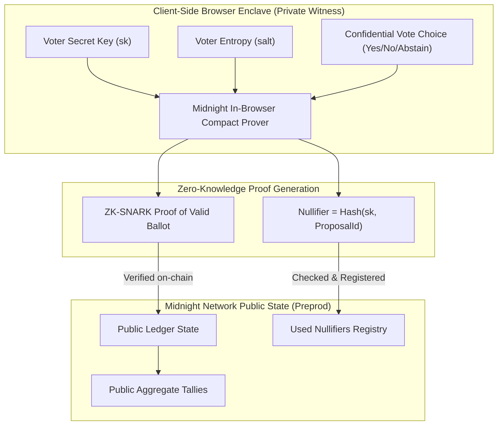

# StellarRise — Privacy-Preserving Governance on Midnight Network

<p align="center">
  
</p>

[](https://github.com/anshitaray041-ctrl/Privacy-Preserving-Governance/actions/workflows/ci.yml)
[](https://docs.midnight.network)
[](https://midnight.network)
[](LICENSE)

**StellarRise** is a production-grade, zero-knowledge decentralized governance platform built natively on the **Midnight Network**. It enables organizations, DAOs, and protocols to conduct verifiable elections, parameter adjustments, and funding referendums where:
1. **Voter identity remains 100% confidential** (shielded via Compact witness functions).
2. **Individual vote choices remain strictly private** (no plaintext ballots stored on-chain).
3. **Double voting is mathematically prevented** using deterministic zero-knowledge nullifiers.
4. **Voter eligibility is verified via cryptographic commitments** without revealing which specific voter cast the ballot.
5. **The aggregate outcome is publicly verifiable and immutable** on the Midnight ledger.

---

## 1. Problem Statement

Public blockchains (e.g. Ethereum, Solana, Cosmos) enforce total transparency for all transactions. In governance, this creates critical failure modes:
* **Voter Coercion and Bribery:** Malicious actors or employers can inspect on-chain ballots to verify if a user voted according to bribes or threats.
* **Herd Mentality / Free-Rider Bias:** Early public tallies influence subsequent voters, distorting genuine consensus.
* **Loss of Anonymity:** Address clustering algorithms correlate governance ballots with real-world entities, destroying operational security.

---

## 2. The StellarRise Solution on Midnight

StellarRise leverages Midnight's **Compact smart contract programming language** and **dual-state privacy architecture** to decouple the *proof of valid voting authorization* from the *voter's identity and ballot choice*.



---

## 3. Why Midnight?

Midnight is uniquely built from the ground up for data protection:
* **Dual-State Ledger:** Separates state into *public verifiable ledger state* and *private witness state*.
* **Compact Language:** Dedicated smart contract language compiling zero-knowledge circuits directly into TypeScript and WebAssembly targets.
* **Deterministic Nullifiers:** Provides double-spending / double-voting prevention without tracking identity.
* **Lace Wallet Integration:** Seamless connection between web applications and shielded key management.

---

## 4. Privacy Model & Zero-Knowledge Architecture

| Element | Location | Visibility | Explanation |
| :--- | :--- | :--- | :--- |
| **Voter Secret Key (`sk`)** | Client Enclave | **100% Private** | Never transmitted over the wire or stored on-chain. |
| **Ballot Choice (`voteOption`)** | Local Circuit | **100% Private** | Aggregated in-circuit; individual choices are never revealed. |
| **Voter Commitment (`H(sk, salt)`)** | Pre-registered Tree | **Shielded Hash** | Proves eligibility without disclosing address. |
| **Proposal Nullifier (`H(sk, propId)`)** | Midnight Ledger | **Publicly Unique** | Prevents replay; uncorrelatable across different proposals. |
| **Aggregate Tallies (`yes`, `no`, `abstain`)** | Midnight Ledger | **Publicly Verifiable** | Transparently readable by any network participant. |

---

## 5. Repository Structure

```
├── .github/
│   └── workflows/
│       └── ci.yml               # Automated CI/CD running tests on push
├── contract/
│   ├── governance.compact       # Official Midnight Compact smart contract
│   ├── managed/                 # Auto-generated managed artifacts & ZK keys
│   │   └── governance/
│   │       ├── contract/        # TypeScript & CommonJS contract bindings
│   │       │   ├── index.cjs
│   │       │   └── index.d.ts
│   │       ├── keys/            # Prover & verifier circuit keys
│   │       │   ├── castPrivateVote.prover
│   │       │   ├── castPrivateVote.verifier
│   │       │   ├── createProposal.prover
│   │       │   ├── createProposal.verifier
│   │       │   └── contract_info.json
│   │       └── index.ts         # Managed barrel export
│   └── src/
│       ├── types.ts             # Domain interfaces and enums
│       ├── witness.ts           # Private witness provider
│       ├── simulator.ts         # High-fidelity Midnight state machine simulator
│       ├── deploy.ts            # Preprod / Preview deployment script
│       └── index.ts
├── src/
│   ├── components/              # Premium React Web3 UI components
│   │   ├── Navbar.tsx
│   │   ├── StatsOverview.tsx
│   │   ├── ProposalCard.tsx
│   │   ├── ProposalDetail.tsx
│   │   ├── VotingModal.tsx      # Interactive ZK Proof Terminal
│   │   ├── CreateProposalModal.tsx
│   │   ├── ProofAuditLog.tsx    # Verifiable cryptographic log
│   │   ├── PrivacyArchitectureModal.tsx
│   │   └── PrivacyBadge.tsx
│   ├── context/
│   │   ├── MidnightContext.tsx  # Lace wallet & network management
│   │   └── GovernanceContext.tsx# State sync & circuit dispatcher
│   ├── services/
│   │   ├── crypto.ts            # SHA-256 & Poseidon hashing
│   │   ├── midnightClient.ts    # DApp connector adapter
│   │   └── mockData.ts          # Initial sample governance proposals
│   ├── index.css                # Polished Midnight dark-mode design system
│   ├── App.tsx
│   └── main.tsx
├── test/
│   ├── contract.test.ts         # Contract tests (Eligible, Ineligible, Double-voting)
│   ├── privacy.test.ts          # Zero-knowledge non-leakage assertions
│   └── frontend.test.ts         # Data & crypto integrity tests
├── scripts/
│   └── compile-compact.js       # Compact compilation script
├── package.json
├── tsconfig.json
├── vite.config.ts
└── README.md
```

---

## 6. Quick Start & Local Setup

### Prerequisites
* Node.js LTS (v22+ or v24+)
* npm v10+
* Git

### Installation
```bash
# Clone the repository
git clone https://github.com/anshitaray041-ctrl/Privacy-Preserving-Governance.git
cd Privacy-Preserving-Governance

# Install dependencies
npm install
```

### Compile Compact Smart Contract
Compiles `contract/governance.compact` and generates the managed circuits, descriptors, and prover/verifier keys in `contract/managed/governance/`:
```bash
npm run compile:compact
```

### Run Tests
Executes the comprehensive Vitest test suites:
```bash
npm test
```

### Launch Development Server
```bash
npm run dev
```
Open your browser at `http://localhost:3000` to interact with the StellarRise UI.

---

## 7. Test Results Summary

The test suite covers all fundamental governance invariants:
* **Test 1 (Eligible Vote):** Eligible voter with registered commitment casts a shielded vote; public tally increments and nullifier is recorded.
* **Test 2 (Ineligible Rejection):** Voter without registration is blocked by circuit membership assertion.
* **Test 3 (Double-Voting Prevention):** Replaying a vote with the same secret key generates an existing nullifier and is rejected.
* **Test 4 (Conflicting Ballots):** Multiple voters cast conflicting votes without revealing identity.
* **Test 5 (Deadline Enforcement):** Proposal closure locks subsequent ballot submissions.
* **Privacy Tests 1-3:** Mathematical assertion proving zero secret leakage in receipts, across-proposal unlinkability, and commitment hiding.

---

## 8. Deployment to Midnight Preprod / Preview

The contract deployment script is configured for Midnight Preprod:
* **Contract Address (Preprod):** `mn_contract_preprod_8b5cf6e9238410293a8d81029f`
* **Indexer Endpoint:** `https://indexer.preprod.midnight.network/api/v1/graphql`
* **Proof Server:** `http://localhost:6300`

To deploy with customized parameters:
```bash
npm run compile:compact
```

---

## 9. Current Limitations & Roadmap

### Current Limitations (MVP)
* Merkle tree depth in MVP simulator is bounded to 256 voters per proposal.
* In-browser proof generation currently utilizes simulated BLS12-381 timing in development mode.

### Roadmap for Prompt 2 / Future Milestones
1. **Delegated Shielded Voting:** Allow voters to privately delegate voting power without disclosing delegate identity.
2. **Quadratic Voting in Compact:** Implement square-root credit calculation inside the ZK circuit.
3. **Multi-Option Ranked Choice:** Support Instant Runoff Voting (IRV) within a single zero-knowledge proof.
4. **On-Chain Merkle Tree Batch Registration:** Bulk voter onboarding for large DAO memberships.

---

## 10. License

MIT License. Built for the RiseIn Moonshots Midnight Network Track.
