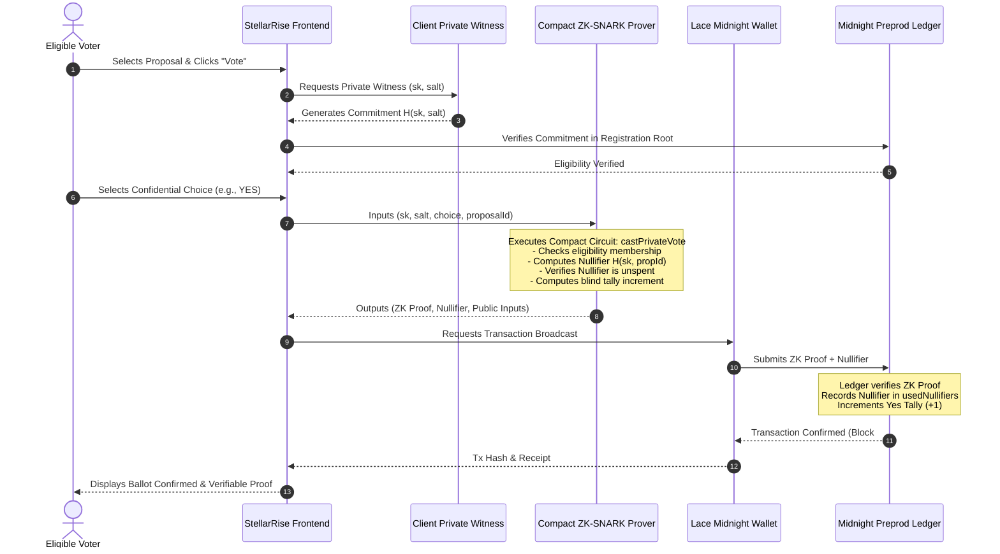

# StellarRise System Architecture

## Architecture Overview

StellarRise separates governance operations across three coordinated tiers:
1. **Client Tier (Private Witness Enclave):** Local browser execution environment holding secret keys, generating commitments, computing nullifiers, and synthesizing zero-knowledge proofs.
2. **Midnight.js / DApp Connector Tier:** Bridge facilitating wallet connection, transaction signing, and network parameter verification via Lace Midnight.
3. **Midnight Consensus & Ledger Tier:** Public verifiable state machine storing proposal metadata, registered voter Merkle roots, spent nullifiers, and aggregate tallies.

---

## Component Breakdown

### 1. Smart Contract (`contract/governance.compact`)
* **State Variables:**
  * `proposalCount`: Global proposal ID counter.
  * `proposals`: Map of proposal ID to `ProposalMeta`.
  * `registeredVoters`: Map of proposal ID to voter commitments.
  * `usedNullifiers`: Map of proposal ID to spent nullifiers.
* **Transitions:**
  * `createProposal(...)`: Public transition initializing proposal metadata.
  * `registerEligibleVoter(...)`: Registers shielded commitments prior to registration deadline.
  * `castPrivateVote(...)`: Private transition executing in-circuit membership proof, nullifier derivation, and blind tally increment.
  * `closeProposal(...)`: Finalizes voting after deadline elapsed.

### 2. Witness Provider (`contract/src/witness.ts`)
* Manages 32-byte secret keys ($sk$) and randomness ($salt$) purely in memory.
* Derives deterministic nullifiers $N = \text{SHA256}(sk \parallel \text{proposalId} \parallel \text{"STELLARRISE\_NULLIFIER"})$.

### 3. Simulation & Runtime Engine (`contract/src/simulator.ts`)
* Implements exact Midnight virtual machine execution rules for automated testing and client-side proof generation.
